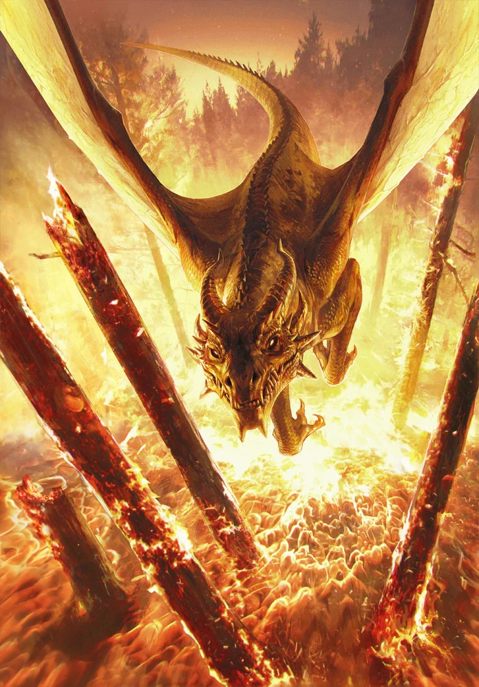

#### Load necessary packages
```{r}
library(ape)
library(ggplot2)
library(reshape2)
library(ggtree)
```

#### Images of added dragons


[Source](https://witcher.fandom.com/wiki/Villentretenmerth)


[Source](https://ghibli.fandom.com/wiki/Haku)


[Source](https://onepiece.fandom.com/wiki/Kaidou)


#### Import Data
```{r}
DragonNexus<-read.nexus.data("Input/DragonMatrix.nex") # Imports dragon nexus file that has been edited to contain the new dragons
tail(DragonNexus) # Shows that tail end of the file for confirmation purposes
```

#### Importing Weight data and converting them into a single vector
```{r}
WeightsDat<-read.csv("Data/Weights.csv") # Imports Weights so be applied to dragon data
Weights<-paste0(WeightsDat$Weight,collapse="") # Isolates just the weights from the data
Weights<-strsplit(Weights,split="")[[1]] # Splits up the the weights into individual characters
```

#### Converting each Weights into numerical values
```{r}
WeightsNum<-rep(NA,length(Weights)) # create empty vector for weights numbers
for(i in 1:length(WeightsNum)){ # A loop that converts that weights from letters and number to just number that represents their weight
  if(Weights[i] %in% LETTERS){
    WeightsNum[i]<-which(LETTERS==Weights[i])+9
  } else {
    WeightsNum[i]<-Weights[i]
  }
}
WeightsNum<-as.numeric(WeightsNum) # Converts to numerical values for weight
```

#### Creates a new data frame that includes the weights
```{r}
WtDragonNexus<-DragonNexus # Make a new weighted data frame object
for (i in 1:length(DragonNexus)){ # a for loop that applies the weights to the new weighted data frame
  RepWeight<-DragonNexus[[i]]==1
  WtDragonNexus[[i]][RepWeight]<-WeightsNum[RepWeight]
  RepWeight<-NA
}
```

#### Calculating the distance matrix with weighted data
```{r}
WtDragonNexusDF<-data.frame(matrix(unlist(WtDragonNexus),ncol= length(DragonNexus[[1]]),byrow=T)) # converts 
row.names(WtDragonNexusDF)<-names(WtDragonNexus) #Adds the same row names as the previous data set
WtDragonDist<-dist(WtDragonNexusDF,method='euclidean') # Euclidean algorithm used to calculate distance with weighted values attached 
```

#### Preping data for building tree
```{r}
WtDragonTree<-fastme.bal(WtDragonDist) #
WtDragonTree$tip.label <- gsub("([1-9\\.]*)([^X]*)X*","\\1\\2", WtDragonTree$tip.label) # Removes just the following X(s) from the tip label
```

#### 
```{r}
WtDTclade<-groupClade(WtDragonTree,.node=c(148,134,124, 111, 85, 122)) # Specifies clade groups
ggtree(WtDTclade,layout="fan",aes(colour=group)) + # Makes plot a plot where each clade is labeled and coloured
  geom_tiplab(size=2,aes(angle=angle)) +
  geom_cladelabel(node=148,label="Serpentidae",hjust=0.5,offset=15,offset.text=4,fontsize=3,angle=-47) +
  geom_cladelabel(node=134,label="Wyvernidae",hjust=0.5, offset=18, offset.text=4,fontsize=3,angle=10) +
  geom_cladelabel(node=87,label="Orientalia",hjust=0.5, offset=19, offset.text=4,fontsize=3,angle=40) +
  geom_cladelabel(node=111,label="Dracopteronidae",hjust=0.5, offset=18, offset.text=4,fontsize=3,angle=-55) +
  geom_cladelabel(node=124,label="Dracoverisidae",hjust=0.5, offset=17, offset.text=4,fontsize=3,angle=64) +
  geom_cladelabel(node=122,label="Dracohumandae",hjust=0.5, offset=16, offset.text=4,fontsize=3,angle=-85) + 
  theme(legend.position="none")
```

__Figure 1.__ **Dragon Phylogeny**

##### Phylogenic tree of dragons with dragons sapared into clades. Dragons separed into clades based on calculated evolutionary distance. Newly discovered Dracohumandae clade contains dragons with magical shiftshaping abilities.